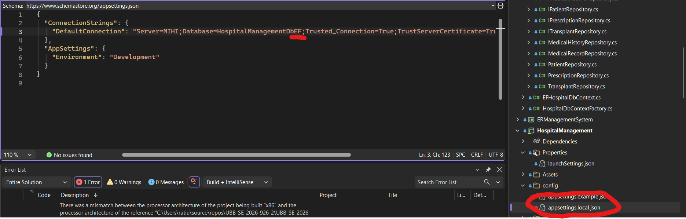
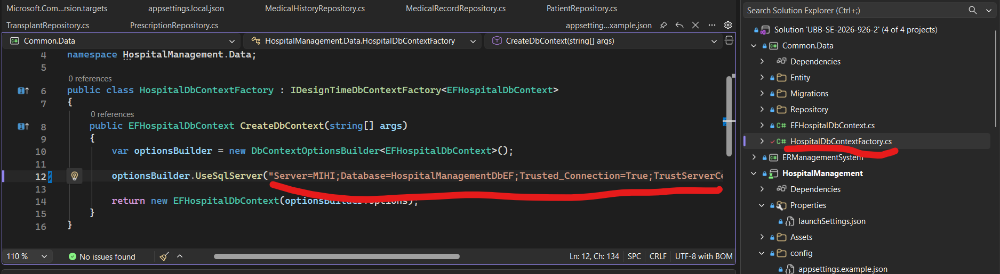
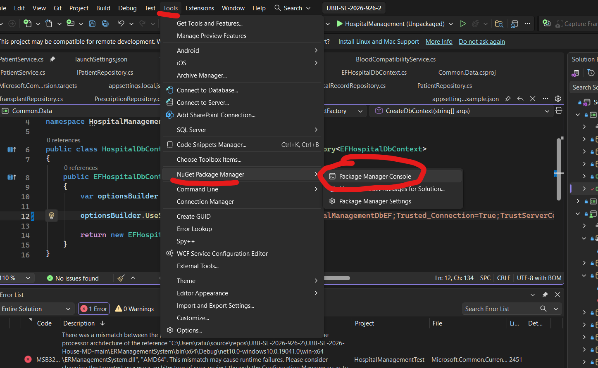
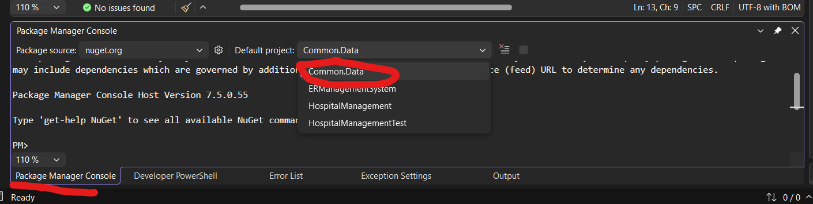
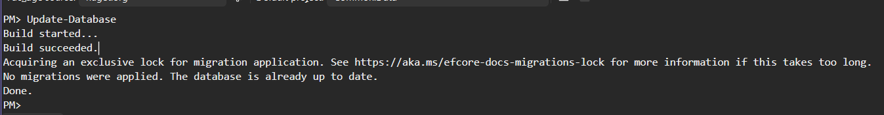

### How to load database

### 1. Humble Begginings
In fisierul appsettings.local.json daca ati mai lucrat pe o baza de date existenta adaugati la final "EF" la nume cat sa genereze alta. Daca nu lasati pe ce era original. Daca nu aveti fisierul un exemplu de cum trebuie sa arate se gaseste in appsettings.example.json

### 2. Making some progress
Copiati connection stringul din appsettings.local.json si aici (Common.Data / HospitalDBContextFactory):

### 3. Getting commando
Open this O_O

### 4. Setting up
Selectati proiectul corect in care sa rulam comenzile.

### 5. Running Db Setup
Rulati "Update-Database" in consola. Daca tot e ok o sa aveti un output similar sau un output extrem de lung dar fara nimica error sau rosu.
