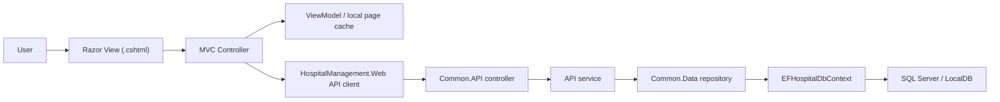
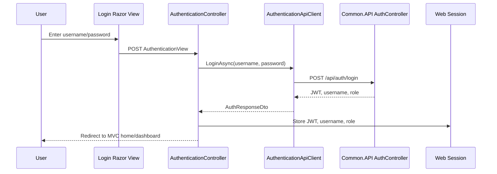
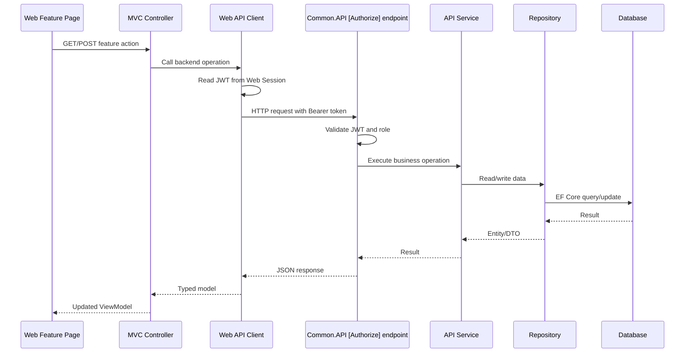
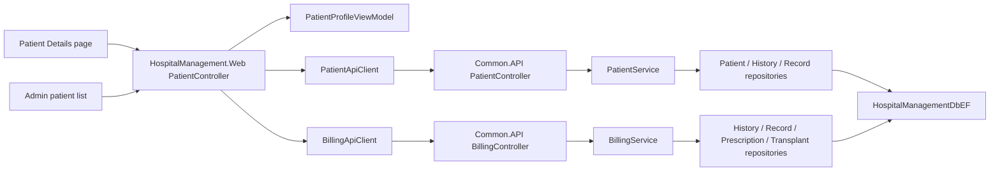
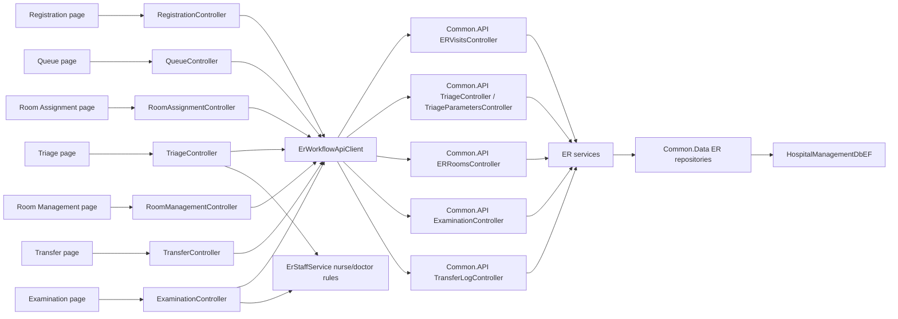
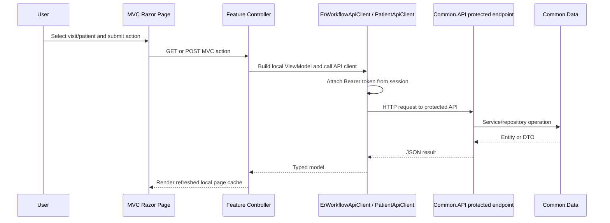

# Web Migration Functionality Diagram

## General MVC Flow

## Authentication Flow

## Protected API Flow

## Patient Migration Flow

## ER Workflow Migration Flow

## Concrete Patient And ER Page Flow

## Current Migration Map

| Old feature | MVC target | Backend/API path |
| --- | --- | --- |
| `PatientView` / `PatientViewModel` | `PatientController`, `Views/Patient/Details.cshtml`, `PatientProfileViewModel` | `api/patients/*`, `api/billing/*` |
| Patient admin list/create/update/archive | `AdminController`, `Views/Admin/*`, `CreatePatientViewModel`, `EditPatientViewModel` | `api/patients/*`, `api/allergies` |
| Authentication | `AuthenticationController`, `Views/Authentication/AuthenticationView.cshtml` | `api/auth/login` |
| `PatientRegistrationViewModel` | `RegistrationController`, `Views/Registration/Index.cshtml`, `RegistrationViewModel` | `api/patients`, `api/patients/exists/{cnp}`, `api/er-visits` |
| `TriageViewModel` | `TriageController`, `Views/Triage/Index.cshtml`, `TriageViewModel`, `ErStaffService` | `api/er-visits`, `api/triages`, `api/triage-parameters` |
| `QueueViewModel` | `QueueController`, `Views/Queue/Index.cshtml`, `QueueViewModel` | `api/er-visits`, `api/triages` |
| `RoomAssignmentViewModel` | `RoomAssignmentController`, `Views/RoomAssignment/Index.cshtml`, `RoomAssignmentViewModel` | `api/er-visits/auto-assign-room`, `api/er-visits/{visitId}/assign-room/{roomId}`, `api/er-rooms` |
| `RoomManagementViewModel` | `RoomManagementController`, `Views/RoomManagement/Index.cshtml`, `RoomManagementViewModel` | `api/er-rooms/status/{status}`, `api/er-rooms/{id}/visit-details`, `api/er-rooms/{id}/mark-cleaning`, `api/er-rooms/{id}/mark-available` |
| `ExaminationViewModel` | `ExaminationController`, `Views/Examination/Index.cshtml`, `Views/Examination/Summary.cshtml`, `ExaminationViewModel` | `api/examinations/*`, `api/er-visits`, `api/triages`, `api/triage-parameters` |
| `TransferLogViewModel` | `TransferController`, `Views/Transfer/Index.cshtml`, `TransferViewModel` | `api/transfer-logs/*`, `api/er-visits/{visitId}/transfer`, `api/er-visits/{visitId}/retry-transfer`, `api/er-visits/{visitId}/close` |
| `ImportView`, `NurseView`, `StateManagementView`, `TimelineView`, standalone `RoomView` | Not migrated in this slice because matching old view/viewmodel files or supported backend endpoints were not found | N/A |
